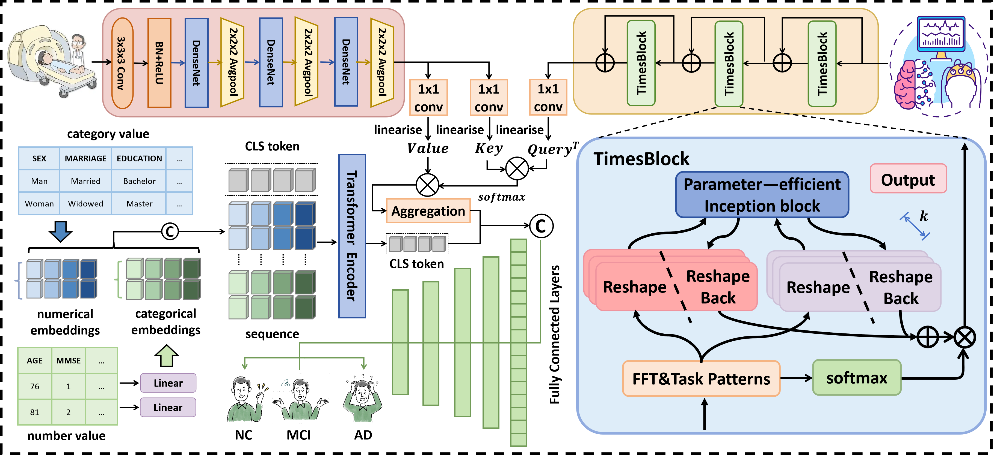
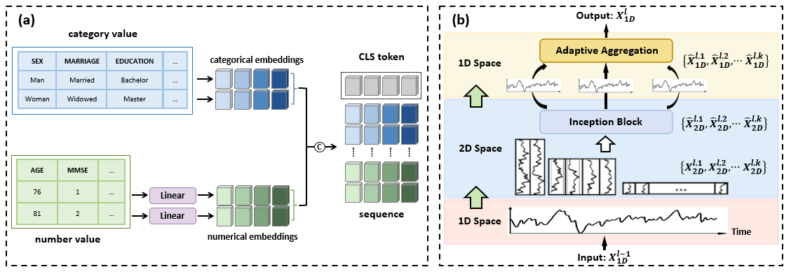

# MSTNet

Overall structure of our proposed MSTNet. The MSTNet model primarily comprises three parts: Tabular Feature Encoder, Temporal Feature Encoder and Cross-modal Aggregation Encoder.


(a) The Feature Tokenizer converts numerical categorical features into embedding vectors. (b) The TimesBlock module performs a 2D transformation on the multi-periodic features of the time-series data.


## 1. Dataset

- Place the dataset in the main folder with the following folder structure for the dataset：
`````
datasets/
├── Table/
│   ├── train.xlsx
│   └── test.xlsx
├── Image/
│   ├── train/
│   └── test/
└── EEG/
    ├── train/
    │   ├── MCI/
    │   ├── HC/
    │   └── AD/
    └── test/
        ├── MCI/
        ├── HC/
        └── AD/
`````
- The file names of the EEG and MRI of the same patient need to be consistent, while the Scale/Table information of all patients is saved in a `.xslx` file, and the first column `number` in the `.xslx` file also needs to be consistent with the corresponding EEG/MRI file name.

## 2. Environment

- Please prepare an environment with `python=3.8`, and then use the command `pip install -r requirements.txt` for the dependencies.

## 3. Train/Test

- Run run.py to Train or test (Put the MRI dataset in nii.gz format into datasets/Image and the EEG dataset in .csv format into datasets/EEG)
- The batch size we used is 20. If you do not have enough GPU memory, the bacth size can be reduced to 12 or 6 to save memory.

## 4. ADMC dataset

- Our experiments were conducted on our private ADMC dataset, which comprises EEG, MRI, and Table data from 100 subjects (mean age: 72.4 years; age range: 56-93 years; 56 females; 22 married). For each patient, the dataset includes a continuous 180-second artifact-free EEG segment recorded at a sampling frequency of 256 Hz, and 72 MRI slices with dimensions of 256×256 pixels. Additionally, the Table data includes MMSE and MoCA scores, with detailed MMSE results providing both a total score and individual item scores. The dataset is divided into 80 samples for training and 20 samples for evaluation.

## 5. Citation

```
@article{chen2024toward,
  title={Toward Robust Early Detection of Alzheimer's Disease via an Integrated Multimodal Learning Approach},
  author={Chen, Yifei and Zhu, Shenghao and Fang, Zhaojie and Liu, Chang and Zou, Binfeng and Wang, Yuhe and Chang, Shuo and Jia, Fan and Qin, Feiwei and Fan, Jin and others},
  journal={arXiv preprint arXiv:2408.16343},
  year={2024}
}
```
